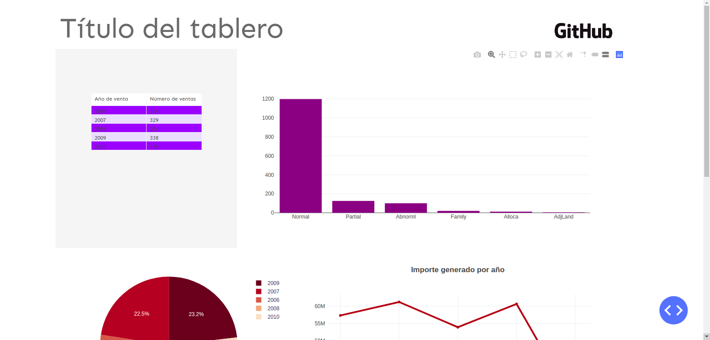
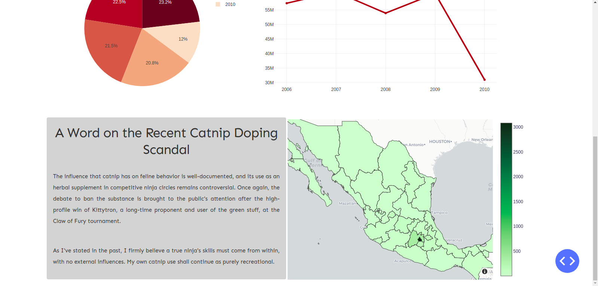
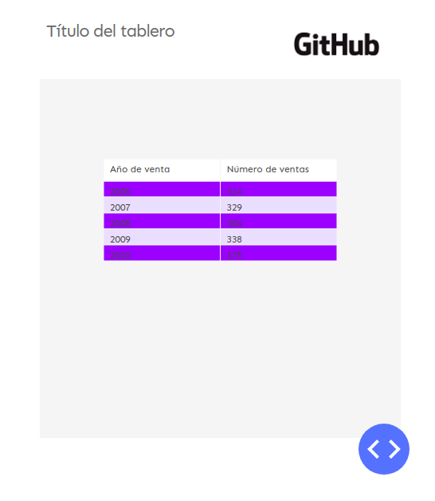
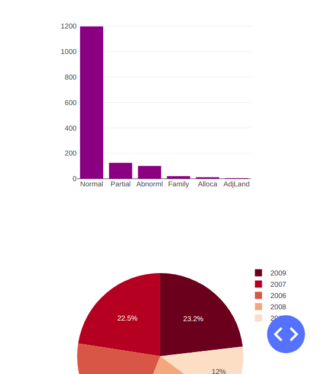
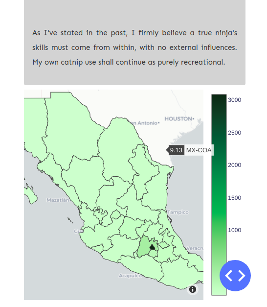

# Template de tablero

#### -- Estatus del proyecto: [Activo]

## 1. Acerca de este proyecto
Usando el código de este repositorio es posible crear tableros usando 
el framework de python [Dash](https://dash.plot.ly/).

La idea es reutilizar el código, producir y personalizar tableros 
de análisis a demanda y de una manera rápida.

Uno de los principales objetivos de este proyecto fué constrtuir un tablero responsivo y que se pudiera consultar 
en dispositivos móviles como los teléfonos inteligentes. Para ello se usaron estilos de ```CSS``` basados en [esta guía 
de estilo](https://codepen.io/chriddyp/pen/bWLwgP) creada por [Chris Parmer](https://github.com/chriddyp).

Una explicación más detallada se puede encontrar en la [Wiki](BLA BLA) de este proyecto.


### 1.1 Métodos usados
* Visualización de datos
* Desarrollo web

### 1.2 Tecnologías usadas
* Python
* Pandas
* Plotly
* Dash
* HTML
* CSS
* JavaScript (un poco)

## 2. Descripción del proyecto

### 2.1 ¿Cómo empezar?

1. Clona este repositorio (aquí un [tutorial](https://help.github.com/articles/cloning-a-repository/)).

2. Los datos que usan los ejemplos de las gráficas en plotly están guardados en este [folder](https://github.com/paupradel/template_tableros/tree/master/chart_demos/data) 
del repositorio. Son datos libres.
    
3. Los notebooks de jupyter que contienen los ejemplos de gráficas realizadas en 
 plotly y adaptadas a dash se encuentran en este [folder](https://github.com/paupradel/template_tableros/tree/master/chart_demos/demos_graficas.ipynb).

4. Para poder utilizar el código se recomienda [crear un ambiente virtual](https://vitux.com/install-python3-on-ubuntu-and-set-up-a-virtual-programming-environment/) e 
instalar las bibliotecas necesarias vía el archivo [```requirements.txt```](https://github.com/paupradel/template_tableros) de este repositorio. 
Lo anterior se puede hacer en la terminal (linux) mediante el siguiente comando.

    ```$ pip install -r requirements.txt```
    
    
## 3. Demo del tablero

El archivo ejecutable en python ```app.py``` que se encuentra en el folde principal del proyecto contiene un demo de 
un tablero responsivo con ejemplos de 5 distintas gráficas y visualizaciones (tabla, barras, líneas, pie y mapa 
coroplético). En ese mismo folder se puede encontrar otro archivo ejecutable ```app_vacio.py```  en donde no se colocaron
gráficas y se puede reutilizar a demanda siguiendo la guía de stilo de dash mencionada arriba, así como la creación de 
gráficas de plotly que se puede consultar en el jupyter notebook también mencionado.

El tablero demo luce de la siguiente manera para una computadora de escritorio,





mientras que en un dispositivo móvil las gráficas se alínean una por una verticalmente,








## Contacto

- Paulina Pradel, pradel.paulina@ciencias.unam.mx